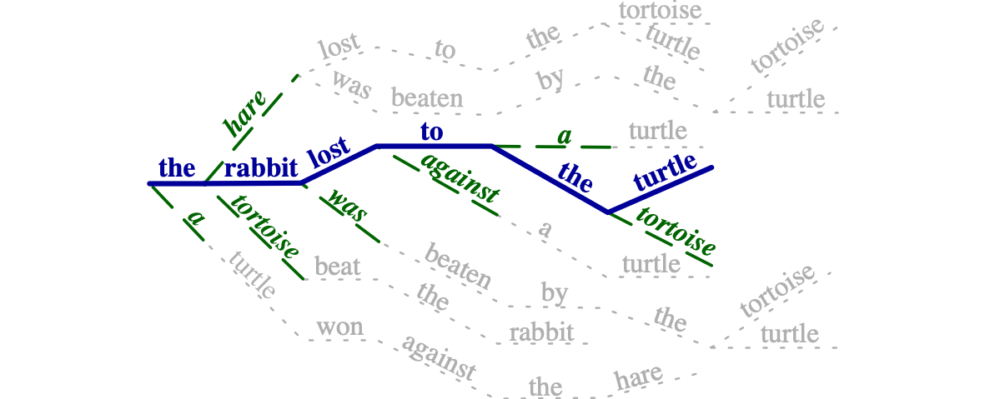

# Simulated Multiple Reference Training (SMRT)

This repo contains a fork of [fairseq](https://github.com/pytorch/fairseq) sufficient to 
replicate the experiments in [Simulated Multiple Reference Training
Improves Low-Resource Machine Translation](https://arxiv.org/abs/2004.14524)
by [Huda Khayrallah](http://cs.jhu.edu/~huda), [Brian Thompson](https://thompsonb.github.io/), 
[Matt Post](http://www.cs.jhu.edu/~post/), [Philipp Koehn](http://www.cs.jhu.edu/~phi/). 

Here's the abstract from the [paper](https://arxiv.org/abs/2004.14524):
>Many valid translations exist for a given sentence, and yet machine translation (MT) is trained 
>with a single reference translation, exacerbating data sparsity in low-resource settings. 
>We introduce a novel MT training method that approximates the full space of possible translations by:
>sampling a paraphrase of the reference sentence from a paraphraser and training the MT model 
>to predict the paraphraser's distribution over possible tokens. With an English paraphraser,
>we demonstrate the effectiveness of our method in low-resource settings, with gains of 1.2 to 7 BLEU.

An illustration of our method is below.
Each time a target sentence in the training data is used,
a paraphrase(blue) is sampled from the many possible paraphrases (grey).
The training objective also takes into account the distribution over all the possible options (green) 
along the sampled path. 




Our method is implemented as a fairseq criterion, enabled via:
```
--criterion smrt_cross_entropy
```

It takes in a pretrained Fairseq paraphraser and data directory for the corresponding dictionary:
```
--paraphraser-model /path/to/paraphraser/paraphraser.pt  
--paraphraser-data-dir /directory/containing/directory/ 
```

During training, our new objective is mixed with standard label smoothed cross entropy training.
To control the fraction of the time the new objective is used:
``` 
--prob-use-smrt 0.5
```

Finally, to control the amount of variation introduced when sampling a path from the paraphraser:
```
--paraphraser-sample-topN 100
```


# Installation Instructions

To install in a conda environment:
```bash
git clone git@github.com:thompsonb/fairseq-smrt.git #or git clone https://github.com/thompsonb/fairseq-smrt.git
cd fairseq-smrt
conda create -n fairseq-smrt python=3.7 pytorch=1.4.0 torchvision=0.5.0 -c pytorch
source activate fairseq-smrt
pip install --editable . #this command needs to be run from inside the fairseq-smrt directory. 
pip install 'tensorboard==2.2.1'
pip install 'tensorboardX==2.0'
```

# Paraphraser Model 
We [release](data.statmt.org/smrt) a pre-trained paraphraser model trained on the [ParaBank2](https://www.aclweb.org/anthology/K19-1005/) dataset,
along along with its associated vocabulary, and the 
[SentencePiece](https://www.aclweb.org/anthology/D18-2012/) model.

In order to use this paraphraser in MT training, 
you must apply this SentencePiece model to the target side of your training data, 
and use this dictionary in training. 


# Replication Example
Below are commands to replicate one of the experiments (hu-en) from the [paper](URL).
We assume you have followed the installation instructions above. 
You should run on a machine with a GPU and [CUDA](https://developer.nvidia.com/cuda-zone).
Other language pairs follow the same pattern. 

```bash
source activate fairseq-smrt
fairseq_smrt=`pwd` #set this to repo path
cd $fairseq_smrt

#download and extract the paraphrase model 
wget data.statmt.org/smrt/smrt-parabank2-fairseq.tgz
tar -xf smrt-parabank2-fairseq.tgz

# download and extract the data split
wget data.statmt.org/smrt/smrt-globalvoices-splits.tgz
tar -xf smrt-globalvoices-splits.tgz

#apply fairseq-preprocess to the files that already have SentencePiece applied
trg=en
src=hu

data=$fairseq_smrt/smrt-globalvoices-splits/$src-$trg
databin=$data/databin
mkdir -p $databin

python $fairseq_smrt/preprocess.py --source-lang $src --target-lang $trg \
        --trainpref $data/train.sp --validpref $data/valid.sp \
        --testpref $data/test.sp  --workers 30 \
        --tgtdict smrt-parabank2-fairseq/dict.en.txt \
        --destdir $databin

# run training
traindir=$fairseq_smrt/expts/$src-$trg
mkdir -p $traindir
mkdir -p $traindir/tensorboard

# The the total batchsize should be 16000. Due to the way batching works in fairseq,
# this should be the product of (\# of gpus) \* (max-tokens) \* (update-freq).\n
# The exact setting of each of these will vary based on your hardware. 
batchsize=4000
updatefreq=4  # set to 4 for 1 GPU, 2 for 2 GPUs, 1 for 4 GPUs if you use a batchsize of 4000

python $fairseq_smrt/train.py \
  $databin \
 --source-lang $src \
 --target-lang $trg \
 --save-dir $traindir \
 --patience 50 --criterion smrt_cross_entropy \
 --paraphraser-model  $fairseq_smrt/smrt-parabank2-fairseq/paraphraser.pt  \
 --paraphraser-data-dir $fairseq_smrt/smrt-parabank2-fairseq/ \
 --paraphraser-sample-topN 100 \
 --prob-use-smrt 0.5 \
 --label-smoothing 0.2 \
 --share-decoder-input-output-embed \
 --arch transformer  --encoder-layers 5 --decoder-layers 5 \
 --encoder-embed-dim 512 --decoder-embed-dim 512 \
 --encoder-ffn-embed-dim 2048 --decoder-ffn-embed-dim 2048 \
 --encoder-attention-heads 2 --decoder-attention-heads 2 \
 --encoder-normalize-before --decoder-normalize-before \
 --dropout 0.4 --attention-dropout 0.2 --relu-dropout 0.2 \
 --weight-decay 0.0001 \
 --optimizer adam --adam-betas '(0.9, 0.98)' --clip-norm 0 \
 --lr-scheduler inverse_sqrt --warmup-updates 4000 --warmup-init-lr 1e-7 \
 --lr 1e-3 --min-lr 1e-9 --no-epoch-checkpoints \
 --max-tokens $batchsize --tensorboard-logdir $traindir/tensorboard \
 --max-epoch 200 --save-interval 10 --update-freq $updatefreq \
 --log-format json --log-interval 500   &> $traindir/train.log

# generate translations
python $fairseq_smrt/generate.py $databin \
      --beam 5 --remove-bpe sentencepiece --gen-subset test  \
      --batch-size 100 --lenpen 1.2 --source-lang $src --target-lang $trg \
      --path $traindir/checkpoint_best.pt  \
      &> $traindir/test.log

# score with sacrebleu
grep '^H' $traindir/test.log  | cut -d- -f 2- | sort -n | cut -f 3-  >  $traindir/test.txt 
cat $traindir/test.txt |  sacrebleu $data/test.raw.$trg > $traindir/test.sacrebleu
```

# License
fairseq(-py) is MIT-licensed.

# Citation

Please cite this work as:
```bibtex
@inproceedings{khayrallah-etal-2020-simulated,
    title={Simulated Multiple Reference Training Improves Low-Resource Machine Translation},
    author={Huda Khayrallah and Brian Thompson and Matt Post and Philipp Koehn},
    year={2020},
    publisher  = {arXiv preprint arXiv:2004.14524},
    url={https://arxiv.org/abs/2004.14524}
}
```
in addition to 
[fairseq](https://www.aclweb.org/anthology/N19-4009).

If you replicate the parameters we use, please cite [FLoRes](https://github.com/facebookresearch/flores).
If you use any data preprocessed with [SentencePiece](https://www.aclweb.org/anthology/D18-2012/) please cite it. 
  
The data used to train the paraphraser comes from [ParaBank2](https://www.aclweb.org/anthology/K19-1005/),
please cite that work if you use the released paraphraser.

If you use the GlobalVoices data please cite [Opus](https://www.aclweb.org/anthology/L12-1246).

If you use any data preprocessed with [SentencePiece](https://www.aclweb.org/anthology/D18-2012/) please cite it. 
